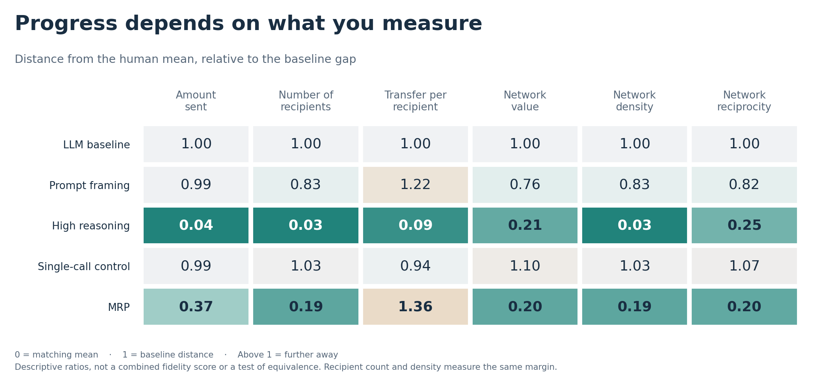
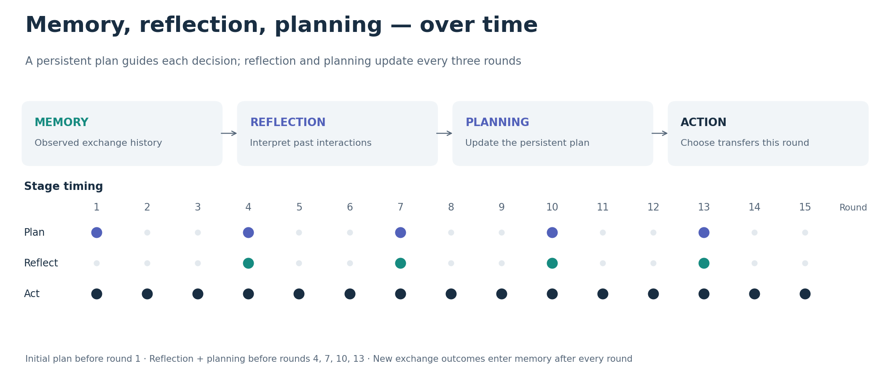

# LLM Agents in a Repeated Exchange Game

**Pau Kraus · Master's thesis · TU Berlin · 2026**

A visual research portfolio for my thesis, *Engineering Behavioral Fidelity in
LLM Agents for Economic Simulations*.

### Can LLM agents reproduce human behavior in this repeated game?

I study **one repeated, six-player gift-exchange game**: how much agents share,
whom they choose, and how those relationships change over fifteen rounds.
The benchmark is observed human behavior in the same experimental game.

The thesis evaluates prompting, model reasoning, and a memory–reflection–planning
(MRP) architecture. Increased reasoning and structured agent design can bring
several outcomes closer to the human benchmark in this setting, although the
improvements depend on what is measured. Transfer amounts, partner selection,
network structure, and relationship dynamics are all part of the comparison.

| Experimental design | Recorded LLM behavior | Human comparison |
| :--- | :--- | :--- |
| 5 conditions · 6 cohorts each | 6 agents · 15 rounds · 2,700 decisions | 12 control cohorts · 72 participants |

[What is tested](#what-i-tested) · [Research design](#the-experiment) · [Results](#what-changed) · [Agent architecture](#memory-reflection-and-planning) · [Run the code](#explore-the-results-yourself)

## What I tested

**RQ1:** Where does the standard LLM setup differ from the human control
benchmark? **RQ2:** How do prompt framing, reasoning effort, and agent
architecture affect those differences?

| Comparison | Question tested | Evidence examined |
| :--- | :--- | :--- |
| Baseline vs. human control | Does the standard LLM setup reproduce the human exchange pattern? | Transfers, partner selection, network structure, and relationship dynamics |
| **H1:** Prompt framing vs. baseline | Can a payoff-focused instruction change behavior enough to address broad, indiscriminate exchange? | Transfer levels, recipient counts, network outcomes, and time trends |
| **H2:** High reasoning vs. baseline | Does increased reasoning reduce indiscriminate giving and encourage more selective allocations? | Giving, recipient counts, density, equal splitting, and partner differentiation |
| **H3:** MRP vs. baseline | Does persistent state improve how agents adapt to particular partners over time? | Heterogeneity, tie removal, reinforcement, reciprocity trends, and responses to past transfers |
| Post hoc single-call control | Can similar reflection/planning tasks inside one call reproduce the persistent MRP pattern? | Aggregate and relationship outcomes compared with baseline and MRP |

These are exploratory comparisons within the **same repeated game**, using
one recorded model configuration. H1–H3 organize the analysis; they were not
preregistered. The intervention tests assess changes from the LLM baseline.
Human means provide the external reference for judging the direction and
size of those changes. [Detailed test map](docs/METHODS.md#questions-and-comparisons).

## What changed


*All figures use the final study results. Primary comparisons cover rounds
1–12; rounds 13–15 are the endgame. Points show condition means, without
uncertainty intervals.*

### 1. The baseline cooperates too broadly

Baseline agents send almost their entire endowment and distribute it across
nearly all five possible partners. Humans send less and maintain fewer active
relationships: **43.4 units to 3.31 recipients**, compared with **97.0 units to
4.90 recipients** for the baseline. Plausible instructions alone do not reproduce
the observed human pattern.

### 2. More reasoning brings several averages close to the benchmark

With high reasoning, mean transfers fall to **41.5 units** and recipient count
to **3.36**. Network density falls from **0.980 to 0.672**, close to the human
mean of **0.661**. These changes from the LLM baseline are supported by the
exploratory statistical analysis. Transfers on surviving ties nevertheless
decrease under high reasoning, while they increase in the human benchmark.
The agreement in averages therefore does not imply matching dynamics.

### 3. MRP changes how relationships develop

Memory, reflection, and planning also reduce broad, near-universal giving. MRP
agents send **63.0 units** to **3.00 recipients**. Their normalized network value
is **0.672**, compared with **0.634** for humans and **0.822** for the baseline.

The relationship dynamics are informative too: MRP agents remove more existing
ties while increasing transfers along the ties that survive. The magnitude of
that reinforcement is still above the human benchmark. The predicted increase
in reciprocity over time remains inconclusive in the linear-trend test.


### 4. Wording alone has a smaller effect

The competitive prompt framing leaves average transfers near the baseline
level. A post hoc control that puts reflection and planning into a single,
non-persistent call also remains close to the baseline on the main aggregate
outcomes. This comparison suggests that how the agent process is organized
matters; it does not isolate the contribution of any one MRP component.

### Where the match improves—and where it does not



Here, **1 is the baseline's distance from the human mean** and **0 is an exact
match of means**. Each column is assessed separately. There is no combined
“human fidelity score,” and recipient count and density measure the same aspect
of behavior at different levels.

## The experiment

Six agents interact repeatedly in a fixed group. In every round, each receives
100 units of its own resource and chooses how much to transfer to each of the
other five agents. Positive transfers incur a cost per recipient. Payoffs
reward resource diversity, so the game creates a tension between keeping
resources, exchanging broadly, and developing selective relationships.

Agents receive feedback about their exchanges and payoffs. There is no direct
chat between agents; relationships emerge through repeated transfers.

| Condition | What changes |
| :--- | :--- |
| **LLM baseline** | The reference setup with the game instructions and factual history |
| **Prompt framing** | One added sentence emphasizes maximizing the agent’s own total payoff |
| **High reasoning** | Provider reasoning effort changes from `none` to `high` |
| **MRP** | Persistent memory, periodic reflection, and a plan guiding decisions |
| **Single-call control** | A post hoc comparison with similar reflection/planning instructions in one call and no persistent MRP state |

All five conditions use the recorded model identifier `mistral-medium-3-5` and
temperature 0.7. Each condition has six independently simulated cohorts. The
human benchmark comes from the control treatment of
[Teubner and Camacho (2023)](https://doi.org/10.1007/s10726-023-09814-4).

## Memory, reflection, and planning



The MRP architecture separates the record of what happened from interpretations
of those interactions and the plan for what to do next. A plan is created before
round 1. Reflection and planning are refreshed before rounds 4, 7, 10, and 13;
the current plan persists between updates. This design is inspired by
[Park et al. (2023)](https://arxiv.org/abs/2304.03442), who combine memory,
reflection, and planning in generative agents. Here, those ideas are adapted
to a fixed repeated game. The game instructions remain unchanged, and agents
are not given the human target values.

The small [schedule example](examples/mrp_schedule.py) makes this timing explicit:

```python
from examples.mrp_schedule import stages_for_round

stages_for_round(1)  # ('plan', 'act')
stages_for_round(2)  # ('act',)
stages_for_round(4)  # ('reflect', 'plan', 'act')
```

This is an explanatory example. The full simulator and experimental archive
are maintained separately for research inspection.

## What the references contribute

| Source | Its role in this project |
| :--- | :--- |
| [Teubner & Camacho (2023)](https://doi.org/10.1007/s10726-023-09814-4) | The repeated exchange game, human control benchmark, network measures, and the cut-and-reinforce pattern. This thesis uses their control condition; photo/avatar treatment effects are outside its scope. |
| Daniel Kral, *P1* (2026; private research software) | The original LLM recreation of that game, which I extended for the thesis. His contribution is the experimental software foundation. |
| [Aher, Arriaga & Kalai (2023)](https://proceedings.mlr.press/v202/aher23a.html) | The evaluation principle of comparing simulated behavior with established human experimental evidence. Their experiments are background, rather than additional tasks tested here. |
| [Lorè & Heydari (2024)](https://doi.org/10.1038/s41598-024-69032-z) | Evidence that contextual framing can affect LLM strategic choices; motivation for the limited framing intervention in this game. |
| [Li & Shirado (2025)](https://aclanthology.org/2025.emnlp-main.267/) | Prior evidence relating deliberation to changes in giving; motivation for examining a reasoning-effort intervention here. |
| [Park et al. (2023)](https://arxiv.org/abs/2304.03442) | The architectural precedent for memory, reflection, and planning; adapted here into a periodic protocol for repeated exchange. |

The numerical LLM results shown above come from **my thesis runs**. The human
values are reconstructed from the original control data. The cited studies
supply the benchmark or motivate the design; they are not the source of these
intervention results. [Full references and scope of each citation](docs/REFERENCES.md).

## My contribution

Building on Daniel Kral's original exchange-game implementation, I developed
and evaluated the thesis interventions, including the periodic MRP architecture
and its single-call comparison. I assembled the final experimental evidence,
compared agent behavior with the human benchmark, and analyzed both aggregate
outcomes and relationship-level dynamics.

The work combines **Python agent development, experimental design, network
analysis, longitudinal statistical models, and reproducibility checks**. The
research archive includes offline replay checks covering all 30 LLM cohorts.

## Explore the results yourself

The code in this showcase is newly written to reproduce these visualizations
from the included aggregate tables and illustrate the protocol. It runs
without an API key or access to participant records. It does not rerun the
original experiments or refit the thesis's statistical models.

Tested with Python 3.13:

```bash
python3 -m venv .venv
source .venv/bin/activate
python -m pip install -r requirements.txt

python scripts/summarize_results.py  # Compare each mean with the human benchmark
python scripts/build_figures.py     # Rebuild the four PNG and SVG figures
python examples/mrp_schedule.py     # Inspect the 15-round MRP schedule
python -m unittest discover -s tests -v
```

| Start here | What it contains |
| :--- | :--- |
| [Aggregate results](data/descriptive_means.csv) | Six outcomes for humans and all five LLM conditions |
| [Relationship results](data/relationship_summary.csv) | Tie removal, retention, formation, and reinforcement |
| [Statistical evidence](data/hypothesis_evidence.csv) | Effect estimates, intervals, and exploratory p-values |
| [References and their role](docs/REFERENCES.md) | Sources for the benchmark, evaluation approach, and intervention design |
| [Methods and interpretation](docs/METHODS.md) | Definitions, analysis choices, and limits |
| [Data provenance](data/README.md) | Where each table comes from and how to read it |

## What these results support

The study provides evidence that reasoning and agent architecture can improve
particular dimensions of behavioral fidelity in this repeated exchange game. It is an
exploratory study with one model configuration and six LLM cohorts per
condition. Closer averages do not establish matching distributions, identical
decision processes, or generalization to other games and models.

## Acknowledgments and citation

**Supervisor and original simulator:** Daniel Kral. **Human experiment:**
Timm Teubner and Sonia Camacho. The public scripts in this repository were
written for the showcase; the original simulator is maintained in the private
research archive.

Please distinguish this showcase and its thesis results from the underlying
human experiment and architectural literature when citing them. Use
[CITATION.cff](CITATION.cff) for the showcase and
[the reference list](docs/REFERENCES.md) for the original sources.
