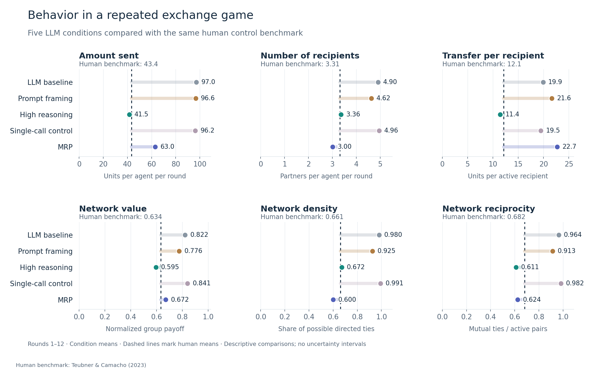
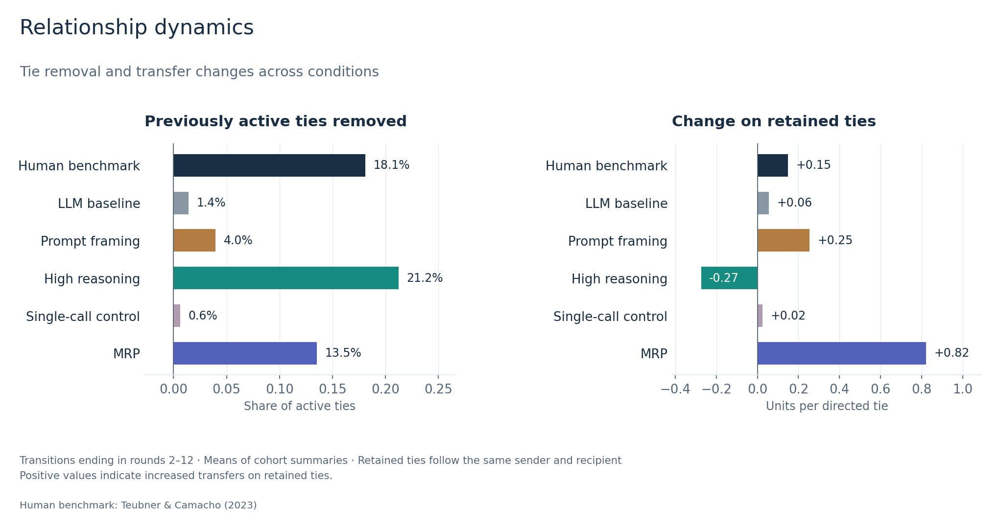

# Behavioral Fidelity in LLM Agents

Selected results and analysis code from *Engineering Behavioral Fidelity in
LLM Agents for Economic Simulations* (master’s thesis, TU Berlin, 2026).

## Study

The study examines whether prompting, reasoning effort, and a
memory–reflection–planning (MRP) architecture can bring LLM behavior closer to
human behavior in **one repeated exchange game**. Outcomes include transfers,
partner selection, network structure, and changes in relationships.

Six agents interact for 15 rounds. Each receives 100 resource units per round
and can transfer resources to five partners, with a cost for each positive
transfer. The human benchmark is the control condition of
[Teubner and Camacho (2023)](https://doi.org/10.1007/s10726-023-09814-4).

| Condition | Intervention |
| :--- | :--- |
| Baseline | Game instructions and factual interaction history |
| Prompt framing | Added emphasis on individual payoff maximization |
| High reasoning | Reasoning effort increased from `none` to `high` |
| MRP | Persistent memory, periodic reflection, and planning |
| Single-call control | Reflection and planning within one call, without persistent MRP state; post hoc comparison |

Each LLM condition comprises six cohorts of six agents, using
`mistral-medium-3-5` at temperature 0.7. The human benchmark comprises 12 cohorts
and 72 participants. Primary analyses cover rounds 1–12.
[Methods and hypotheses](docs/METHODS.md).

## Results



Baseline agents transfer 97.0 units per round to 4.90 recipients, compared with
43.4 units and 3.31 recipients in the human benchmark. High reasoning reduces
these means to 41.5 and 3.36; MRP reduces them to 63.0 and 3.00. Prompt framing
and the single-call control remain closer to baseline behavior.



MRP combines tie removal with increased transfers on retained ties, although
reinforcement exceeds the human benchmark. High reasoning reduces transfers
on retained ties. Closer aggregate means therefore do not establish matching
relationship dynamics.

These exploratory results suggest that reasoning and structured agent design
can improve selected dimensions of behavioral fidelity in this game. The
figures show descriptive means without uncertainty intervals. Statistical
tests assess changes from the LLM baseline; they do not establish equivalence
to human behavior. Generalization beyond the tested game and model remains
unexamined.

[Relative distances from human means](assets/benchmark_gaps.png) ·
[Effect estimates and intervals](data/hypothesis_evidence.csv)

## Agent protocol

MRP maintains an interaction history and a persistent plan. Planning occurs
before round 1; reflection and planning are updated before rounds 4, 7, 10,
and 13. The design adapts ideas from
[Park et al. (2023)](https://arxiv.org/abs/2304.03442).
Agents receive no human target values.
[Protocol diagram](assets/mrp_protocol.png) ·
[Schedule example](examples/mrp_schedule.py).

## Reproduction

The included scripts reproduce the figures and descriptive comparisons from
aggregate tables. They also illustrate the MRP schedule. The experimental
simulator, raw records, statistical fitting code, and thesis manuscript are
maintained separately. No API key is required.

Tested with Python 3.13:

```bash
python3 -m venv .venv
source .venv/bin/activate
python -m pip install -r requirements.txt
python scripts/summarize_results.py
python scripts/build_figures.py
python examples/mrp_schedule.py
python -m unittest discover -s tests -v
```

[Data and provenance](data/README.md) · [Methods](docs/METHODS.md) ·
[Citation](CITATION.cff)

## References

| Source | Role |
| :--- | :--- |
| [Teubner & Camacho (2023)](https://doi.org/10.1007/s10726-023-09814-4) | Game, human benchmark, and network measures |
| [Aher et al. (2023)](https://proceedings.mlr.press/v202/aher23a.html) | Evaluation against human experimental evidence |
| [Lorè & Heydari (2024)](https://doi.org/10.1038/s41598-024-69032-z) | Motivation for prompt framing |
| [Li & Shirado (2025)](https://aclanthology.org/2025.emnlp-main.267/) | Motivation for the reasoning intervention |
| [Park et al. (2023)](https://arxiv.org/abs/2304.03442) | Memory, reflection, and planning architecture |

The LLM results are from the thesis experiments. The cited studies supply the
human benchmark or inform the design. [Full references](docs/REFERENCES.md).

## Acknowledgments

Daniel Kral supervised the thesis and provided the starting code for the
experiments. [Attribution](ATTRIBUTION.md).
